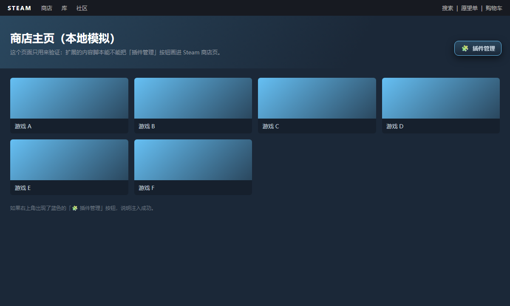

# Steam 商店一键进插件管理页

在 **Steam 商店页面**上注入一个悬浮按钮，**点一下就跳到 `chrome://extensions`**。
再也不用每次"⋮ → 更多工具 → 扩展程序"一层层点进去了。

- 支持 **Steam 客户端内置浏览器**（Chromium / CEF 内核）和 **Chrome / Edge / Brave** 等 Chromium 系浏览器
- 悬浮按钮**可拖动**，位置自动记忆
- 万一浏览器拦截跳转，会弹出手动提示面板：显示地址 + 一键复制 + 再试一次
- 只申请 **`storage`** 一个权限：不联网、不读页面内容、不收集任何数据



---

## 安装

### 方式一：加载已解压的扩展程序（推荐）

1. 到 [Releases](https://github.com/HeSheng114514/steam-one-click-extensions/releases) 下载 `steam-one-click-extensions-v1.0.0.zip` 并解压
2. 在浏览器地址栏输入 `chrome://extensions`（Edge 会自动跳 `edge://extensions`）
3. 打开右上角的 **开发者模式**
4. 点 **加载已解压的扩展程序**，选中解压出来的 **`steam-one-click-extensions`** 文件夹

> 从源码仓库克隆的话，选 `Steam商店一键进插件页` 文件夹，是同一套代码。

### 方式二：自己打包成 CRX

双击 `重新打包CRX.bat`（或执行 `打包成CRX.ps1`），它会调用本机 Chrome/Edge 自带的
Chromium 打包器生成 `.crx`；把生成的 `.crx` 拖进 `chrome://extensions` 即可安装。

- 首次运行时会**自动生成一对新密钥**（`Steam商店一键进插件页.pem`），扩展 ID 由它决定；
- **请保管好这个 `.pem`**：后续更新想保持同一个扩展 ID 就得用它，`*.pem` 已被 `.gitignore` 排除，不要外传。

---

## 使用

| 位置 | 操作 | 结果 |
| --- | --- | --- |
| **Steam 商店页面** | 点右上角 **「🧩 插件管理」** | 当前页直接跳到 `chrome://extensions` |
| 任意页面 | 点工具栏上的扩展图标 | 同样跳转 |
| 那个悬浮按钮 | 按住拖动 | 挪到顺手的位置，位置会被记住 |

按钮出现在所有 `store.steampowered.com` 页面上（主页、搜索、游戏详情…），后期想改成只显示在主页也很容易，改 `manifest.json` 的 `matches` 即可。

---

## 原理

网页自己**不允许**跳转到 `chrome://` 这类浏览器内部地址（浏览器安全策略），
所以流程是：

```
内容脚本（content.js）在商店页画出按钮
      ↓ 点击
chrome.runtime.sendMessage  →  后台 Service Worker（background.js）
      ↓
chrome.tabs.update(tabId, {url: "chrome://extensions/"})
```

后台属于扩展环境，具备导航到内部页的权限。这一点在 Chromium 上实测通过：
最终标签页 URL 为 `edge://extensions/`（Chrome 里即 `chrome://extensions`），页面标题「扩展」。

---

## 目录结构

```
├─ Steam商店一键进插件页/    扩展源码
│  ├─ manifest.json          清单（MV3，权限只有 storage）
│  ├─ content.js             注入悬浮按钮 / 拖动 / 失败提示面板
│  ├─ content.css            按钮样式（Steam 深蓝配色）
│  ├─ background.js          收到消息后导航到 chrome://extensions
│  ├─ icons/                 16 / 32 / 48 / 128 图标
│  └─ tools/make_icons.py    重新生成图标（Pillow）
├─ 重新打包CRX.bat          一键打包（Windows）
├─ 打包成CRX.ps1            打包脚本本体
└─ 预览-商店页按钮效果.png
```

---

## 常见问题

**点按钮没反应？**
到 `chrome://extensions` 确认扩展是「已启用」，并确认它有 `store.steampowered.com` 的站点访问权限。

**按钮挡住内容了？**
按住它拖走，位置会被记住。

**Steam 大版本更新后按钮不见了？**
Steam 更新偶尔会重建 CEF 配置目录（`%LOCALAPPDATA%\Steam\htmlcache`），重新加载一次扩展即可。

---

## 许可证

[GPL-3.0](LICENSE) © HeSheng
